# 🩺 Skin Cancer Detection using Deep Learning & Explainable AI


> Automated multi-class skin cancer classification using DenseNet121 + Grad-CAM, achieving **85.7% test accuracy** on the HAM10000 dataset with explainable AI for clinical trust.

---

## 📊 Results at a Glance

| Model | Train Accuracy | Val Accuracy | Test Accuracy |
|-------|---------------|--------------|---------------|
| Basic CNN | 81.85% | 68.85% | - |
| ResNet50 | 82.02% | 68.85% | - |
| MobileNetV2 | 70.57% | 72.50% | - |
| **DenseNet121 + Grad-CAM** | **94.57%** | **83.03%** | **85.7%** ✅ |

---

## 🔬 Sample Data

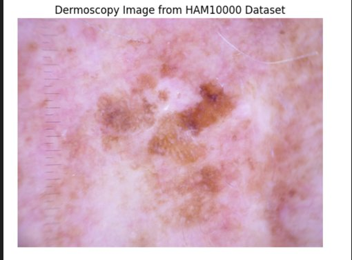

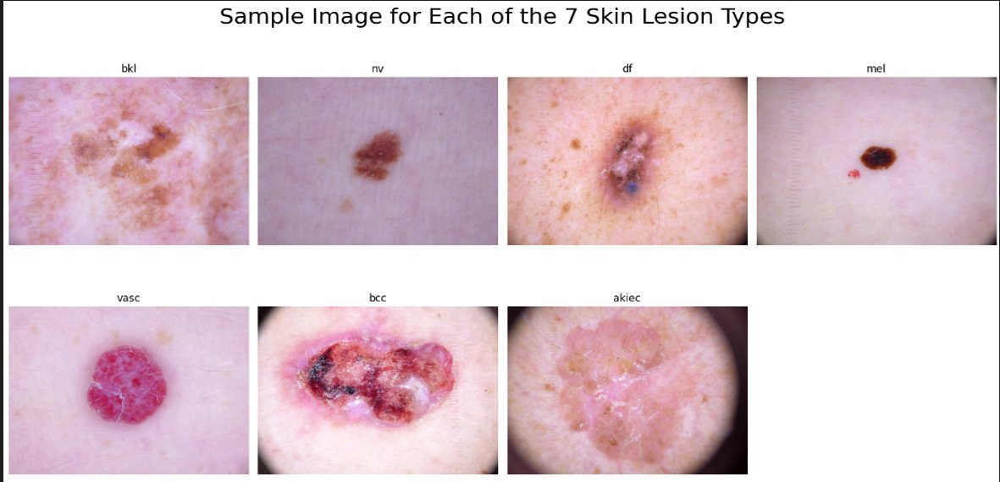

---

## 🧠 Model Architecture

**Best Model: DenseNet121 + Explainable AI (Grad-CAM)**

- Pre-trained DenseNet121 fine-tuned on HAM10000
- Grad-CAM for visual explainability — highlights affected lesion regions
- Multi-class classification across 7 skin lesion types

---

## 📈 Training Curves

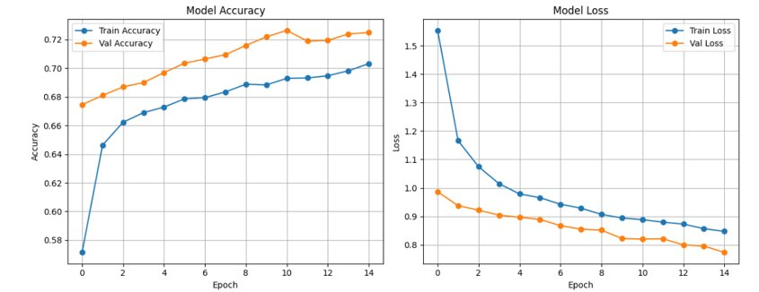

---

## 🎯 Model Comparison

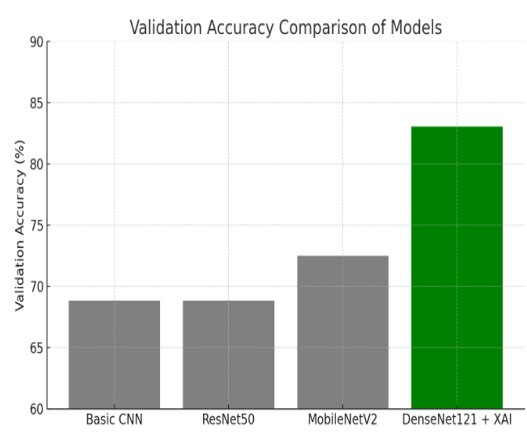

---

## 🔥 Explainable AI — Grad-CAM Visualizations

Grad-CAM highlights the regions the model focuses on — enabling clinical trust and interpretability.

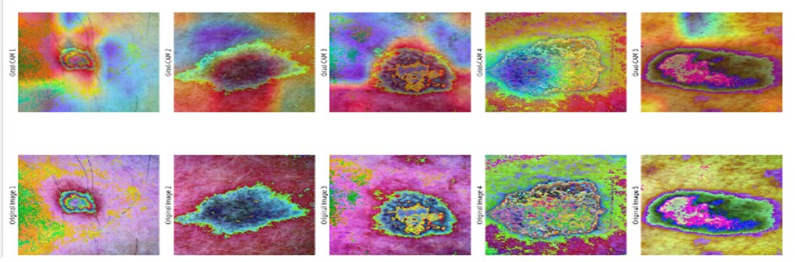

| Original Image | Grad-CAM Heatmap |
|---------------|-----------------|
| 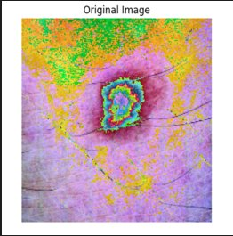 | 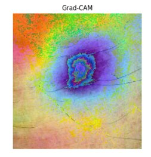 |
| 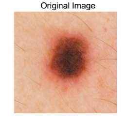 | 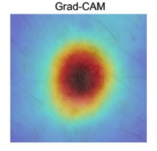 |

---

## 📋 Classification Report (DenseNet121)

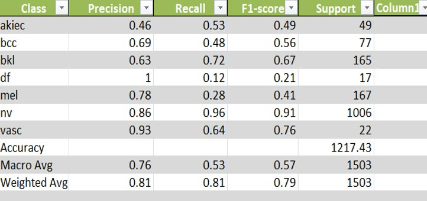

| Metric | Score |
|--------|-------|
| Precision | 0.81 |
| Recall | 0.81 |
| F1-Score | 0.79 |
| Weighted Avg Accuracy | **85.7%** |

---

## 🗂️ Confusion Matrix

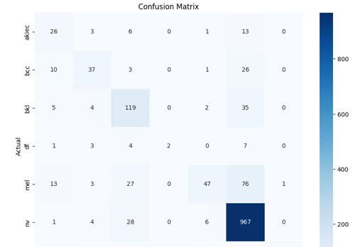

---

## 🗂️ Dataset

**HAM10000 — Human Against Machine with 10000 training images**

| Class | Description |
|-------|-------------|
| `nv` | Melanocytic Nevi |
| `mel` | Melanoma |
| `bkl` | Benign Keratosis |
| `bcc` | Basal Cell Carcinoma |
| `akiec` | Actinic Keratoses |
| `vasc` | Vascular Lesions |
| `df` | Dermatofibroma |

---

## ⚙️ Tech Stack

| Category | Tools |
|----------|-------|
| Language | Python 3.8+ |
| Deep Learning | TensorFlow, Keras |
| Models | CNN, ResNet50, MobileNetV2, DenseNet121 |
| XAI | Grad-CAM |
| Data Processing | NumPy, Pandas, OpenCV |
| Visualization | Matplotlib, Seaborn |
| Platform | Google Colab / Kaggle |

---

## 🚀 How to Run

```bash
git clone https://github.com/yashikasharma2004/SKIN_CANCER_DETECTION--DEEP_LEARNING-.git
cd SKIN_CANCER_DETECTION--DEEP_LEARNING-
pip install -r requirements.txt
jupyter notebook final-code-skin-cancer.ipynb
```

---

## 🔑 Key Highlights

- ✅ Compared **4 deep learning architectures** — CNN, ResNet50, MobileNetV2, DenseNet121
- ✅ **DenseNet121** outperformed all with 85.7% test accuracy
- ✅ **Grad-CAM** explainability for clinical trust and transparency
- ✅ **Data augmentation** — rotation, zoom, flipping to reduce overfitting
- ✅ Evaluated using precision, recall, F1-score, confusion matrix

---

## 🔮 Future Scope

- Integration into web/mobile app for real-time diagnosis
- Advanced models — EfficientNet, Vision Transformers (ViT)
- Cloud deployment for remote healthcare
- Federated learning for privacy-preserving training

---

## 👩‍💻 Author

**Yashika Sharma**  
B.Tech CSE | Thapar Institute of Engineering & Technology  
📧 ysharma1_be23@thapar.edu  
🔗 [GitHub](https://github.com/yashikasharma2004) | [LinkedIn](https://linkedin.com/in/yashikasharma2004)

---

## 📄 License

This project is licensed under the MIT License.
